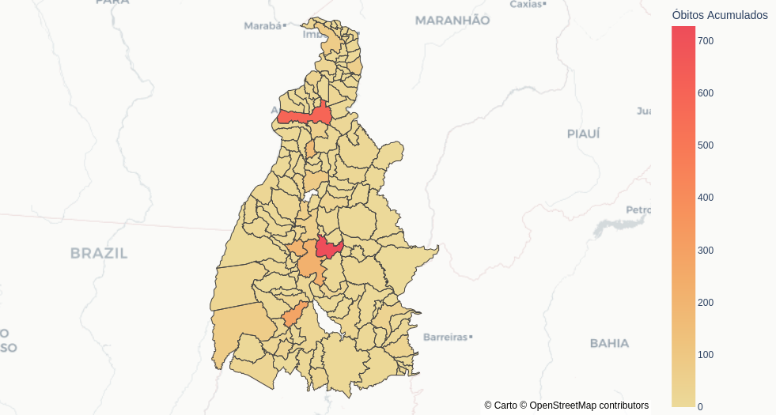
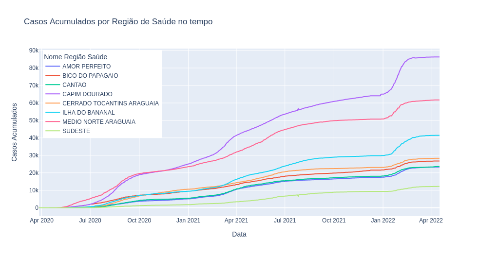
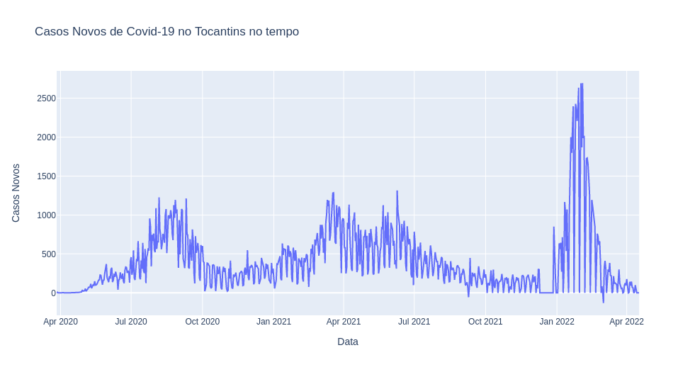
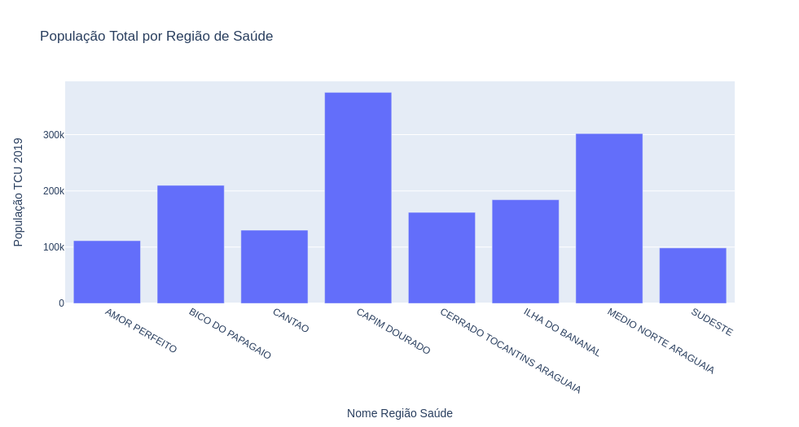

# Tocantins-covid19-analysis

Este repositório apresenta uma análise dos dados de covid-19 no Estado do Tocantins. A análise completa dos dados está disponível no arquivo [Tocantins-covid19-analysis](Tocantins-covid19-analysis.ipynb).

## Requisitos

Para rodar o arquivo [Tocantins-covid19-analysis](Tocantins-covid19-analysis.ipynb) na sua máquina, é necessário que você tenha o Anaconda instalado na sua máquina (caso você não tenha, basta instalar neste [link](https://www.anaconda.com/)) e as seguintes bibliotecas em Python:
- pip install pandas
- pip install plotly

## Dados

Os dados filtrados para o Estado do Tocantins já estão no diretório "data", no arquivo tocantins.csv. Caso queira atualizar com os dados mais recentes, basta baixar o arquivo .rar no site do [ministério da saúde](https://covid.saude.gov.br/) e mover para o diretório data. Em seguida, basta rodar o arquivo [main.py](main.py) que este fará a extração dos arquivos (estes arquivos contém informações do Brasil todo) e o próprio script irá filtrar os dados de covid-19 no Tocantins para o arquivo tocantins.csv.

Antes de rodar o arquivo main.py, é necessário instalar a biblioteca:
- pip install patool

## Figuras exemplo

Estas são algumas figuras que você ira encontrar no arquivo [Tocantins-covid19-analysis](Tocantins-covid19-analysis.ipynb) (No arquivo, as figuras são interativas e podem ser clicadas para filtrar as informações que você quiser).

Qualquer coisa, dê um feedback.
